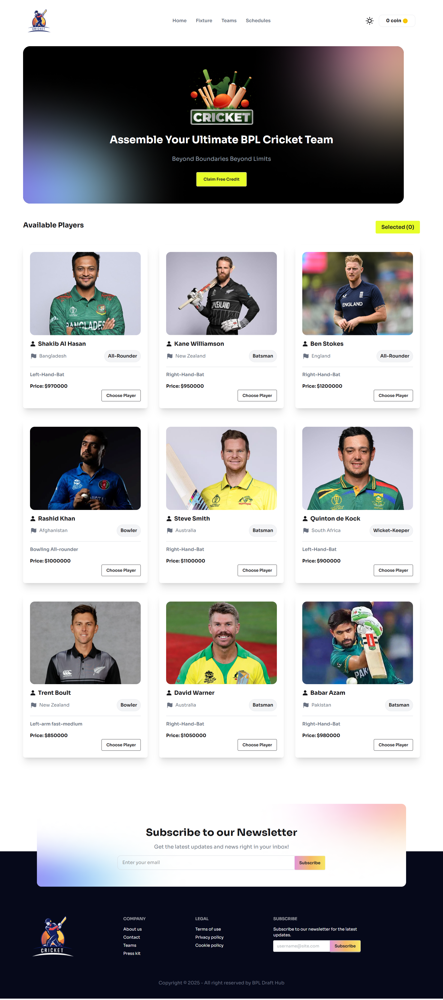

# 🏏 BPL Draft Hub

A modern web application that simulates the player selection process for the **Bangladesh Premier League (BPL)** draft. Users can select players, manage a virtual team, and experience an interactive draft-style interface built with React and Tailwind CSS.

🔗 **Live Site**: [bpl-draft-hub.vercel.app](https://bpl-draft-hub.vercel.app/)

---

## ✨ Features

- 🎮 **Player Selection** – Add up to 6 players to your team with visual feedback.
- 🧹 **Remove Players** – Delete any selected player dynamically.
- 🔍 **Responsive UI** – Seamless design across mobile, tablet, and desktop devices.
- ⚡ **Interactive Animations** – Smooth hover effects and transition styling.
- 📦 **React + Tailwind** – Built with modern frontend tools for speed and style.

---

## 🛠️ Tech Stack

- **React JS** – UI rendering and component architecture
- **Tailwind CSS** – Utility-first responsive design
- **Daisy UI** – Pre-built Tailwind components for speed and consistency
- **Vite** – Fast development server and build tool

---

## 📷 Screenshots

